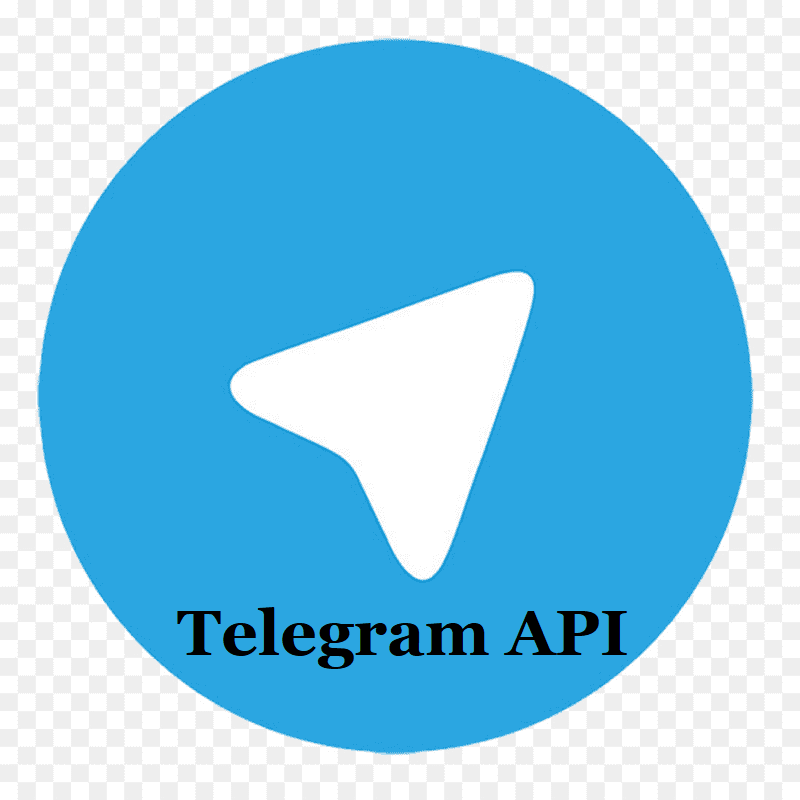

[![Contributors][contributors-shield]][contributors-url]
[![Forks][forks-shield]][forks-url]
[![Stargazers][stars-shield]][stars-url]
[![Issues][issues-shield]][issues-url]
[![MIT License][license-shield]][license-url]

<!-- PROJECT LOGO -->
<br />
<p align="center">
  <a href="https://github.com/othneildrew/Best-README-Template">
    
  </a>

  <h3 align="center">Telegram API</h3>

  <p align="center">
    A simple API made for telegram bots, With this you can speed up your time in creating telegram bots!
    <br />
    <a href="https://github.com/HighestDreams/TelegramAPI"><strong>Explore the docs »</strong></a>
    <br />
    <br />
    <a href="https://github.com/HighestDreams/TelegramAPI">View Example created bot</a>
    ·
    <a href="https://github.com/HighestDreams/TelegramAPI/issues">Report Bug</a>
    ·
    <a href="https://github.com/HighestDreams/TelegramAPI/issues">Request Feature</a>
  </p>
</p>


<!-- TABLE OF CONTENTS -->
<details open="open">
  <summary>Table of Contents</summary>
  <ol>
    <li>
      <a href="#about-the-project">About The Project</a>
      <ul>
        <li><a href="#built-with">Built With</a></li>
      </ul>
    </li>
    <li>
      <a href="#getting-started">Getting Started</a>
      <ul>
        <li><a href="#installation">Installation</a></li>
      </ul>
    </li>
    <li><a href="#usage">Usage</a></li>
    <li><a href="#license">License</a></li>
  </ol>
</details>


<!-- ABOUT THE PROJECT -->
## About The Project

[![Product Name Screen Shot][product-screenshot]]

There are many great Telegram APIs available on GitHub, however, I didn't find one that really suit my needs so I created this one. I want to manage & code my telegram bots easily (without being confused in coding), So i think this is it.

Here's why:
* Your time should be focused on creating something amazing. A project that solves a problem and helps others.
* You shouldn't be doing the same tasks over and over.

Of course, no one api will serve all projects since your needs may be different. So I'll be adding more in the near future. You may also suggest changes by forking this repo and creating a pull request or opening an issue. Thanks to all the people have contributed to expanding this project!

### Built With

* [Telegram](https://core.telegram.org/bots/api)
* [PHP](https://php.com)


<!-- GETTING STARTED -->
## Getting Started

This is an example of how you may give instructions on setting up your project locally.
To get a local copy up and running follow these simple example steps.

### Installation

1. First [Download TelegramAPI](https://example.com).
2. Place directory ```TelegramAPI``` into your project directory.
3. Open your Main bot php file (For example : 
4. Your Bot.php should be like :
   ```PHP
   <?php
/* Important */
use TelegramAPI\Telegram;
/* Important */
spl_autoload_register(function ($class){require_once __DIR__ . '/' . str_replace('\\', '/', $class) . '.php';});
/* Important */
$Telegram = new Telegram("Your Telegram Bot TOKEN"); /* Get a token from @Botfather */
   ```


<!-- USAGE EXAMPLES -->
## Usage

How to send messages with this API?
```PHP
/** Syntax
  * $message = A message that bot will send to user.
  * $chatID = User/Channel/Group chat ID that can you get with method: $message->chatID();
  * $botReply = Set it to true if you want to robot reply to user sent messages (Default is false).
  * $userReply = Set it to true if you want to user reply to robot sent messages (This is ForceReply, Default is false).
  * $keyboard = Add keyboard to the message.
  */
$message->send(string $message, $chatID, bool $botReply, bool $userReply, array $keyboard);
```
Example :
```PHP
/* To access message functions */
$message = $Telegram->message();
/* To check if user sent a message to robot! */
if (!is_null($message->text())) {
    /* To check if user sent message is /start */
    if ($message->text() === '/start') {
        /* With this, bot will send only a message to user */
        $message->send("This is a message that bot sent.");
    }
}
```
How to add Glass buttons to the message?
```PHP

```

_For more examples, please refer to the [TelegramAPI-Example](https://Github.com/HighestDreams/ETelegramAPI-Example)_


<!-- MARKDOWN LINKS & IMAGES -->
<!-- https://www.markdownguide.org/basic-syntax/#reference-style-links -->
[contributors-shield]: https://img.shields.io/github/contributors/HighestDreams/TelegramAPI?style=for-the-badge
[contributors-url]: https://github.com/HighestDreams/TelegramAPI/graphs/contributors
[forks-shield]: https://img.shields.io/github/forks/HighestDreams/TelegramAPI?style=for-the-badge
[forks-url]: https://github.com/HighestDreams/TelegramAPI/network/members
[stars-shield]: https://img.shields.io/github/stars/HighestDreams/TelegramAPI?style=for-the-badge
[stars-url]: https://github.com/HighestDreams/TelegramAPI
[issues-shield]: https://img.shields.io/github/issues/HighestDreams/TelegramAPI?style=for-the-badge
[issues-url]: https://github.com/HighestDreams/TelegramAPI/issues
[license-shield]: https://img.shields.io/github/license/HighestDreams/TelegramAPI?style=for-the-badge
[license-url]: https://github.com/HighestDreams/TelegramAPI/blob/master/LICENSE.txt
[product-screenshot]: images/screenshot.png
